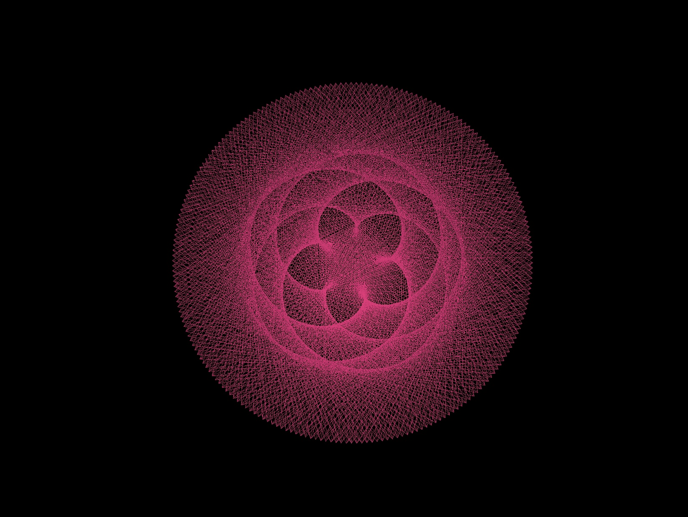
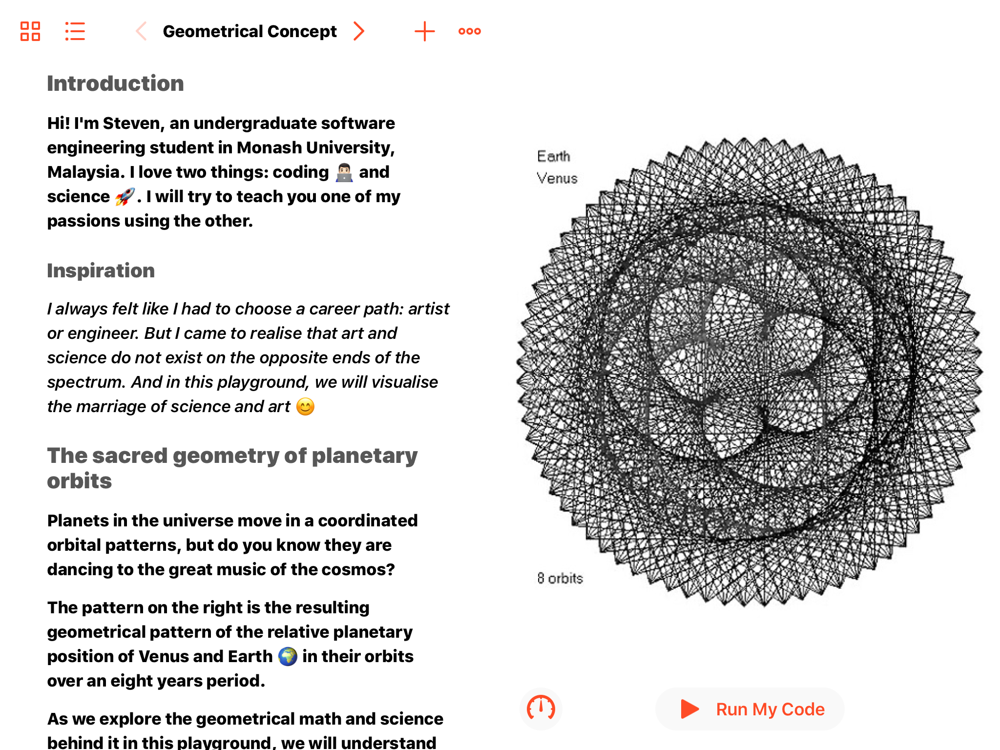
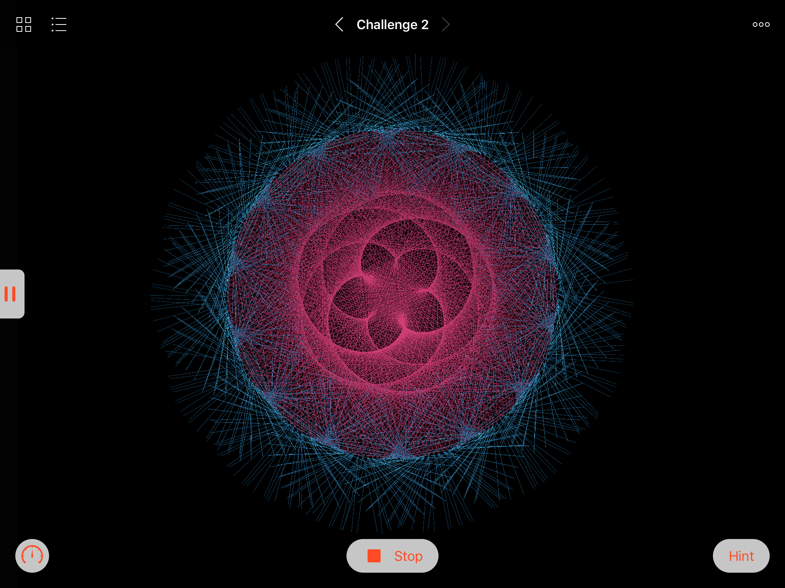
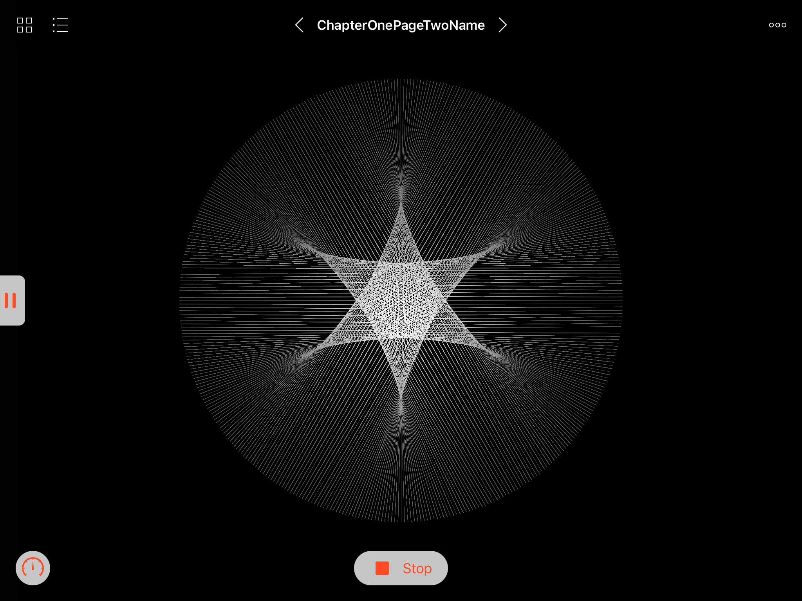
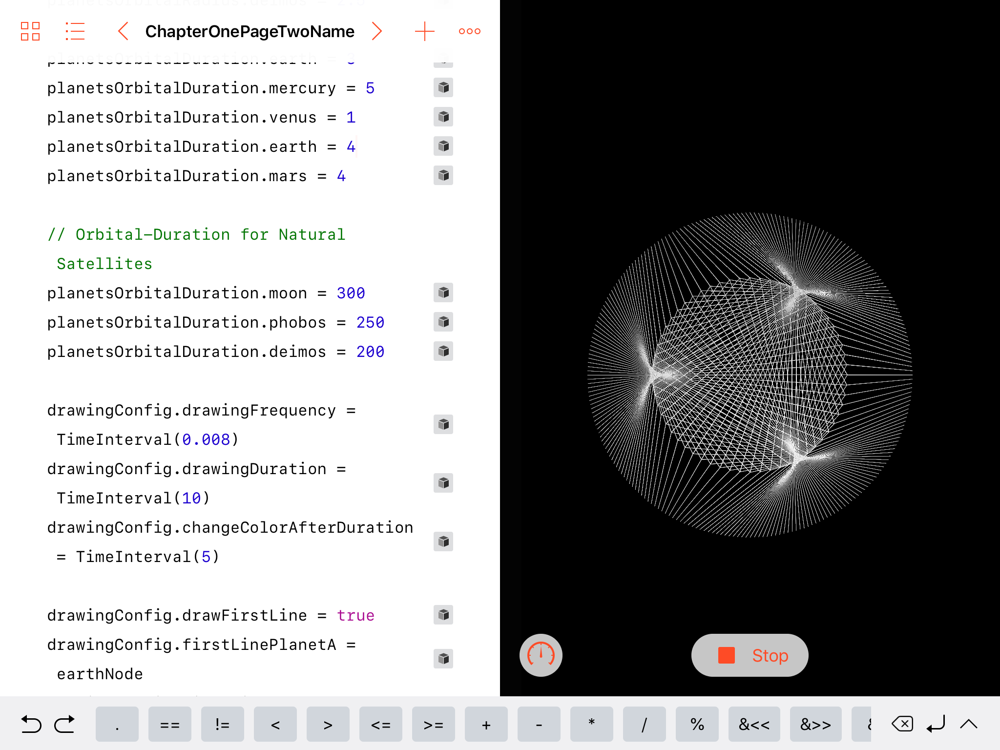
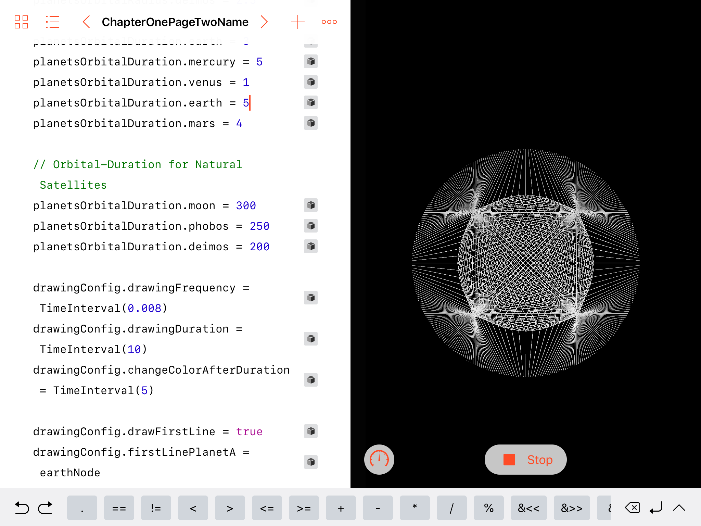
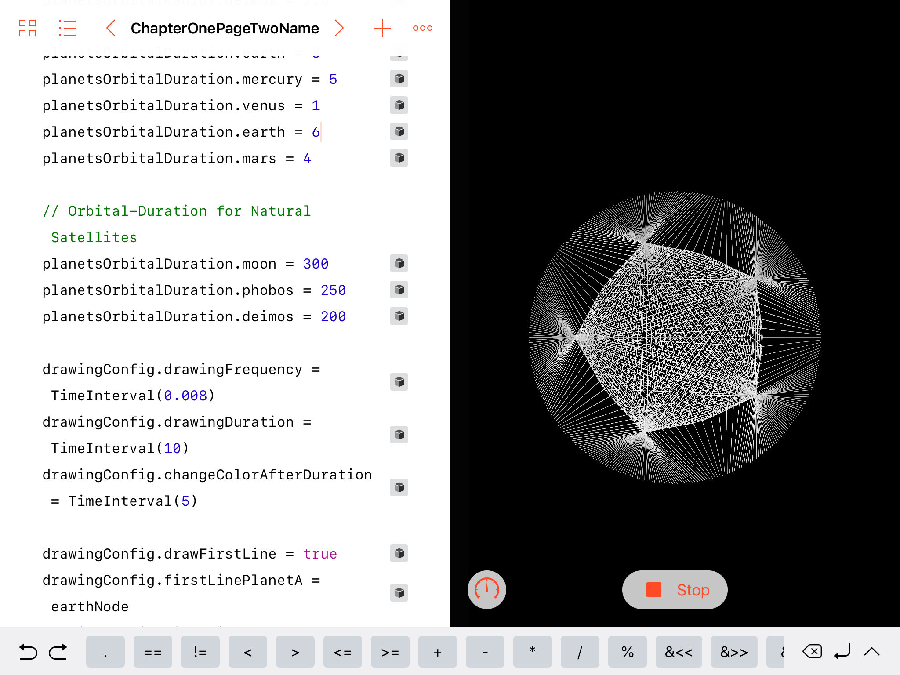

# Cosmics Harmonica

Using science to create art 🎨- WWDC19 Scholarship Winner

### About:

While the intention of allowing the users to learn about science concepts (i.e. rotational speed, orbital radius) is paramount, there is also a bigger purpose to it for this playground. It is about changing the perception in our society.

### Design Rationale:

In the latter part of the playground, I allow the kids/users’ imagination to run wild (as that is all that is about arts, freedom to think). The playground encourages them to create geometrical patterns using science concepts that they will learn in this playground. And by altering the orbital speed and radius, they get to understand how it affects the formation of geometrical patterns, the maths and the science behind the arts.

### Author:
[Steven Tan](https://github.com/StevenTan)

## Screenshot:

## So the whole sequence is 
* learning the actual science facts (the actual math behind flower-pattern formation between the dance of Venus-Earth) and then 
* allow them to apply the scientific knowledge they have learnt earlier together with their creativity to create art. 

*Essentially, it’s about one Playground, but infinite possibilities.*

## Using science to create ARTS 🎨
* by altering the lines' colours and inter-planetary rotational speeds

## Using science to create MUSIC 🎼
* by experimenting with different orbital speeds, notice the formation of 4th and 5th harmonic?

